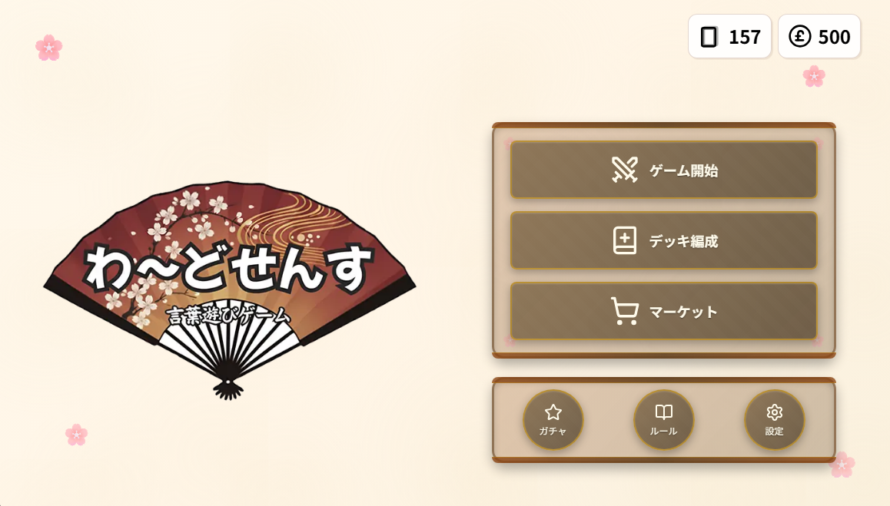
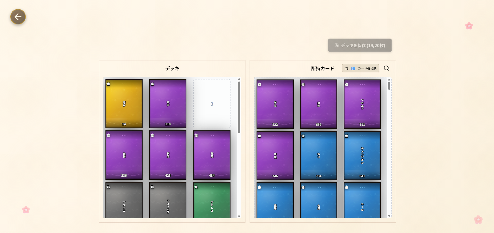
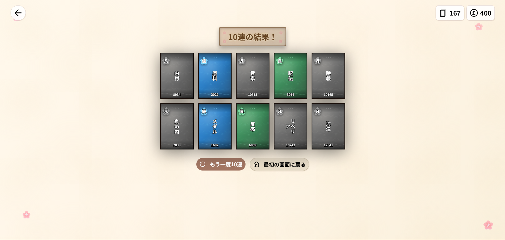
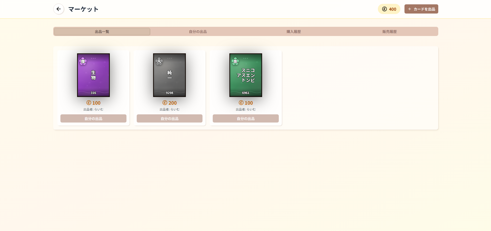

# わ～どせんす



## 📱 アプリの概要

**わ～どせんす**は、Word2Vecを用いた単語の意味的距離（コサイン類似度）を競う、オンライン対戦型カードゲームです。

お題に近い日本語を手札のカードを組み合わせて作成し、ベクトル演算で新しい単語を生成しながら、相手と戦略的に勝負します。

### 🌐 デプロイURL

https://word-sence.vercel.app/

> ドメインを取得次第、正式なURLを公開予定です。

### 🎮 何ができるのか

- **リアルタイムオンライン対戦**: 2人対戦で、Word2Vecベクトルによる類似度計算で勝負
- **戦略的なデッキ構築**: 15,000枚のカードから20枚を選んでデッキを作成
- **単語生成システム**: 手札のカードを足し引きして、お題に近い新しい単語を生成
- **ガチャシステム**: レアリティ別の排出率でカードを獲得
- **マーケットシステム**: カードをゲーム内通貨（ジェム）で売買

---

## 💡 開発背景

### 課題と解決したいこと

1. **暇な時間を解消できる軽いカードゲームを作成したい**
   - GodFieldのような暇なときにできるカードゲームを作成したかった
   - 大人数でも、待ち時間が長くならないゲームが欲しかった

2. **戦略性と運のバランス**
   - カードゲームの戦略性（デッキ構築、読み合い）
   - 大人数で待ち時間のないゲームを構築

3. **ガチャ要素とフリー2プレイのバランス**
   - ガチャで良いカードを当てられなくても差が広がりにくい設計
   - マーケットで好きな単語を集められる仕組み

### 参考にしたもの

- **[ラムダ技術部さんの動画「【数値化】言葉の足し算をするAIで遊んでみた」](https://www.youtube.com/watch?v=sK3HqLwag_w)**
  - Word2Vecを用いた言葉の足し引きの概念を参考
  - ベクトル演算で新しい単語を生成するアイデアを採用

---

## 🎯 主な機能一覧

### 1. オンライン対戦システム

**特徴:**

- リアルタイムで相手と対戦
- フェーズ制のゲームフロー（アクション→提出→対応→判定）
- 勝利宣言システムによる心理戦要素

**ゲームフロー:**

1. デッキから5枚ドロー
2. お題カードが提示される
3. アクションフェーズ（60秒）
   - カード交換（デッキ or 全プール）
   - 単語生成（ベクトル演算）
4. 提出フェーズ（30秒）
   - 通常提出（+1点 / 0点）
   - 勝利宣言（+2点 / -2点）
5. 対応フェーズ（20秒）
   - 勝利宣言へのコール/フォールド
6. 判定フェーズ（10秒）
   - コサイン類似度計算
   - レアリティボーナス適用
   - 先に3ポイント獲得で勝利

> [テスト動画](https://youtu.be/nCK2oWB1TpI)

### 2. デッキ編成システム

**特徴:**

- 20枚のデッキを構築
- 1クリックでの素早い移動
- レアリティによるフィルター機能
- デッキカードはレアリティボーナスの対象

**機能:**

- 所持カード一覧から選択
- レアリティ・検索によるフィルター
- デッキの保存・削除・名前変更



### 3. ガチャシステム

**特徴:**

- 10連ガチャ（100ジェム）
- レアリティ別の排出率
- カード総数15,000枚のため、基本的に10連で引ける

**排出率:**

- コモン: 50%
- レア: 30%
- スーパーレア: 15%
- エピック: 4.5%
- レジェンド: 0.5%



### 4. マーケットシステム

**特徴:**

- 所持カードをゲーム内通貨（ジェム）で売買
- 手数料なし（売上全額が出品者へ）
- 購入履歴・販売履歴の確認

**機能:**

- カードの出品・価格設定
- マーケット一覧からの購入
- 自分の出品一覧・販売履歴



### 5. 単語生成システム

**特徴:**

- 手札のカードを「+ゾーン」「-ゾーン」に配置
- Word2Vecベクトルの足し引きで新しい単語を生成
- 生成に使ったカードは消費される

**仕組み:**

```
+ゾーン: [科学] + [実験] = 意味を加算
-ゾーン: [愛] = 意味を減算
↓
生成結果: [研究]（お題に近い単語）
```

---

## 🛠️ 使用技術と選定理由

### フロントエンド

#### Next.js 15 (App Router)

**選定理由:**

- **SSR/SSG対応**: 初期ロードの高速化とSEO対策
- **App Router**: 最新のReact Server Componentsでパフォーマンス最適化
- **TypeScript統合**: 型安全な開発環境
- **Vercelデプロイ**: 簡単なデプロイとCDN配信

#### TypeScript

**選定理由:**

- **型安全性**: 大規模なカードデータ（15,000枚）を扱う際の型安全性
- **開発体験**: IDE補完とエラー検出の向上
- **保守性**: チーム開発でのコード品質向上

#### Tailwind CSS

**選定理由:**

- **ユーティリティファースト**: 迅速なUI開発

#### Shadcn/ui

**選定理由:**

- **カスタマイズ性**: コンポーネントをコピーして自由に編集可能
- **アクセシビリティ**: Radix UIベースでアクセシビリティ対応
- **TypeScript**: 完全な型定義

### バックエンド

#### Convex

**選定理由:**

- **リアルタイム同期**: WebSocketベースの自動同期で即座に反映
- **型安全なクエリ**: TypeScriptと完全統合されたクエリシステム
- **サーバーレス**: スケーラビリティと運用コストの削減
- **自動API生成**: クエリ・ミューテーション・アクションが自動生成

#### Clerk

**選定理由:**

- **認証機能の簡素化**: OAuth、メール認証などを簡単に実装
- **セキュリティ**: 業界標準の認証プロトコル
- **Convex連携**: シームレスな統合

### ベクトル計算API

#### FastAPI

**選定理由:**

- **高速性**: 非同期処理による高速なAPI応答
- **型安全性**: Pydanticによるリクエスト/レスポンスの型検証
- **自動ドキュメント**: OpenAPI/Swaggerによる自動生成

#### NumPy / gensim (Word2Vec)

**選定理由:**

- **効率的な計算**: 大規模なベクトル演算を高速処理
- **日本語Word2Vec**: 日本語コーパスで訓練されたモデル
- **コサイン類似度計算**: 単語間の意味的距離を正確に計算

### 開発ツール

#### Jest / React Testing Library

**選定理由:**

- **テスト自動化**: CI/CDでの自動テスト実行
- **カバレッジ**: コードカバレッジの測定

#### ESLint / Prettier

**選定理由:**

- **コード品質**: 一貫したコードスタイル
- **自動修正**: 保存時の自動フォーマット

---

## 📊 データベース設計（ER図）

### テーブル構成

```
┌─────────────────┐
│      user       │
├─────────────────┤
│ _id (PK)        │
│ clerk_id        │
│ email           │
└─────────────────┘
         │
         │ 1:1
         ▼
┌─────────────────┐
│    profiles     │
├─────────────────┤
│ _id (PK)        │
│ user_id (FK)    │
│ name            │
│ icon            │
│ gem             │
└─────────────────┘
         │
         │ 1:N
         ▼
┌─────────────────┐
│   user_card     │
├─────────────────┤
│ _id (PK)        │
│ user_id (FK)    │
│ card_id (FK)    │
│ quantity        │
│ acquired_at     │
└─────────────────┘
         │
         │ N:1
         ▼
┌─────────────────┐
│      card       │
├─────────────────┤
│ _id (PK)        │
│ card_number     │
│ text            │
│ rarity          │
└─────────────────┘
         │
         │ N:M
         ▼
┌─────────────────┐
│   deck_card     │
├─────────────────┤
│ _id (PK)        │
│ deck_id (FK)    │
│ card_id (FK)    │
│ position        │
└─────────────────┘
         │
         │ N:1
         ▼
┌─────────────────┐
│      deck       │
├─────────────────┤
│ _id (PK)        │
│ user_id (FK)    │
│ deck_name       │
└─────────────────┘

┌─────────────────┐
│     market      │
├─────────────────┤
│ _id (PK)        │
│ user_id (FK)    │
│ card_id (FK)    │
│ price           │
│ status          │
│ created_at      │
│ updated_at      │
└─────────────────┘

┌─────────────────┐
│     battle      │
├─────────────────┤
│ _id (PK)        │
│ player_ids[]    │
│ game_status     │
│ current_round   │
│ current_phase   │
│ field_card_id   │
│ players[]       │
│ round_results[] │
└─────────────────┘
```

### 主要なリレーション

1. **user ↔ profiles**: 1対1の関係（ユーザー情報とプロフィール）
2. **user ↔ user_card**: 1対多の関係（ユーザーが複数のカードを所持）
3. **card ↔ user_card**: 1対多の関係（1枚のカードが複数のユーザーに所持される）
4. **deck ↔ deck_card**: 1対多の関係（デッキに複数のカードが含まれる）
5. **card ↔ deck_card**: 多対多の関係（カードは複数のデッキに含まれる）
6. **user ↔ market**: 1対多の関係（ユーザーが複数のカードを出品）

---

## 🏗️ インフラ構成図

```
┌─────────────────────────────────────────────────────────────┐
│                        ユーザー                            │
│                    (Webブラウザ)                           │
└────────────────────┬────────────────────────────────────────┘
                     │ HTTPS
                     ▼
┌─────────────────────────────────────────────────────────────┐
│                    Vercel (CDN)                            │
│  ┌──────────────────────────────────────────────────────┐  │
│  │         Next.js 15 (App Router)                      │  │
│  │  - SSR/SSG                                           │  │
│  │  - React Server Components                           │  │
│  │  - Static Assets                                     │  │
│  └──────────────────────────────────────────────────────┘  │
└────────────────────┬────────────────────────────────────────┘
                     │
                     │ WebSocket / HTTP
                     ▼
┌─────────────────────────────────────────────────────────────┐
│                    Convex (BaaS)                           │
│  ┌──────────────────────────────────────────────────────┐  │
│  │  - リアルタイムDB (PostgreSQL)                       │  │
│  │  - リアルタイム同期 (WebSocket)                       │  │
│  │  - クエリ/ミューテーション/アクション                 │  │
│  │  - ユーザー認証 (Clerk連携)                           │  │
│  └──────────────────────────────────────────────────────┘  │
└────────────────────┬────────────────────────────────────────┘
                     │
                     │ HTTP
                     ▼
┌─────────────────────────────────────────────────────────────┐
│              Railway (FastAPI Server)                      │
│  ┌──────────────────────────────────────────────────────┐  │
│  │  FastAPI                                             │  │
│  │  - /calculate-similarity (コサイン類似度計算)        │  │
│  │  - /generate-word (単語生成)                        │  │
│  │  - Word2Vec Model (日本語)                          │  │
│  │  - NumPy (ベクトル演算)                              │  │
│  └──────────────────────────────────────────────────────┘  │
└─────────────────────────────────────────────────────────────┘

┌─────────────────────────────────────────────────────────────┐
│                    Clerk (認証)                            │
│  - OAuth認証                                               │
│  - メール認証                                               │
│  - JWT発行                                                  │
└─────────────────────────────────────────────────────────────┘
```

### データフロー

1. **ユーザー認証**: Clerk → Convex (JWT検証)
2. **リアルタイム対戦**: Next.js ↔ Convex (WebSocket)
3. **ベクトル計算**: Convex → FastAPI → Convex (HTTP)
4. **静的アセット**: Vercel CDN (画像、CSS等)

---

## 🎨 ゲームの特徴

### カードシステム

- **カード総数**: 15,000枚
- **データソース**: 日本語版Wikipedia全データから出現頻度が高い単語を使用
- **レアリティ**: 出現頻度が高いほど高レアリティ（汎用性が高いため）

### レアリティとボーナス

| レアリティ   | アイコン | 排出率 | ボーナス（デッキカード時） |
| ------------ | -------- | ------ | -------------------------- |
| コモン       | ★        | 50%    | +0.00                      |
| レア         | ★★       | 30%    | +0.03                      |
| スーパーレア | ★★★      | 15%    | +0.05                      |
| エピック     | ★★★★     | 4.5%   | +0.05                      |
| レジェンド   | ★★★★★    | 0.5%   | +0.08                      |

### デッキ編成

- 所持カードから20枚のカードを選んでデッキを作成
- 1クリックでの素早い移動機能
- 所持カードのフィルター機能により効率的なデッキ編成が可能

### マーケット

- 所持カードをゲーム内通貨で売買可能
- ガチャで良いカードを当てられなくても差が広がりにくい設計
- 高レアリティだけでなく、好きな単語を簡単に集めることができる

### ガチャシステム

- ログインボーナスや対戦報酬で獲得できるゲーム内通貨を使用
- カード総数が15,000枚と多いため、基本的に10連で引くことが可能
- ガチャ自体が引けないストレスを解消する設計

---

## 🎮 遊び方

### 対戦の流れ

1. **デッキから5枚ドロー**
2. **お題が提示される**
3. **手札のカードを足し引きして1枚選択**
4. **お題との近似値でバトル！**
5. **誰かが3勝するまで繰り返す**

---

## 🛠️ 開発環境設定

### 事前設定済みの機能

#### 開発環境設定

- VSCode設定（`.vscode/settings.json`）
  - 保存時の自動フォーマット
  - ESLint自動修正
  - インポートの自動整理
  - ファイルタイプ別のフォーマッター設定

#### テスト環境設定

- **Jest設定**（`jest.config.ts`）
  - Next.js統合
  - TypeScript対応
  - React Testing Library統合
  - 絶対パス（`@/`）サポート
  - カバレッジレポート
- **テスト構造**
  - Feature-basedアーキテクチャ
  - 機能別テスト分離（`features/*/__test__/`）

#### コード品質管理

- **ESLint設定**（`eslint.config.mjs`）
  - Next.js推奨設定
  - TypeScript対応
  - React/React Hooks対応
  - Prettier連携
  - 命名規則の強制
- **Prettier設定**（`.prettierrc`）

---

## 🙏 謝辞

- **ラムダ技術部さん**: Word2Vecを用いた言葉の足し引きの概念を参考にさせていただきました
- **Convex**: リアルタイムDBとバックエンドの提供
- **Vercel**: フロントエンドのホスティング
